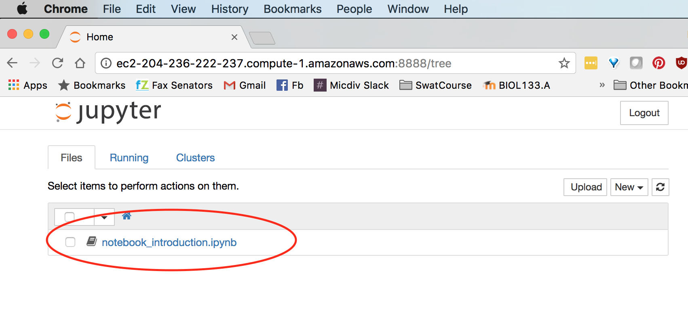

# Introduction to Jupyter (ipython) Notebooks


It's impossible to create a *reproducible* analysis if you aren't logging what you've done.  
Duly noted.  
But how should you do this when the science you're doing is just typing commands into the terminal?

We can do better than just copy/pasting commands into a text document!
This tutorial will walk you through the basic usage of one tool called [Jupyter notebooks](http://jupyter.org/)
that will help you take notes and create shareable, reproducible workflows for your data analysis.


### # Launching the notebook server & using `screen`
We'll be working on this tutorial for a while and, as you noticed last time, 
sometimes the the wifi cuts out and interrupts your `ssh` connection. 

**WHAT TO DOOOO???** 

*`screen` TO THE RESCUE* 

`screen` is a command that will keep processes running on the remote computer, 
even your local connection is interrupted (e.g. wifi cuts out!). 
From your EC2 instance:
```
screen
```
Now that screen is running (we'll go over what that means more in a minute), 
launch the jupyter notebook server from your EC2 instance:

```
ipython notebook
```
Note that this doesn't return the command prompt.  The command is still running, 
and will run until you shutdown the notebook server.  That's good!  

*BUT what if you want to run other commands?*  
- We'll detach this screen and leave it running in the background. 
- To do this, type `Ctrl-a d`
Now your screen is chugging away in the background!
- Where did it go?

```
screen -ls
```
This shows you what screens are running in the background.  
You can start an new screen, or resume an old one.  To resume this screen you can type:
```
screen -x
```
Alternatively, you could enter `screen -r NUMBER` where `NUMBER` is the first part of the ID shown by `screen -ls`

[Read here for more on the useful things you can do as a screen power-user](https://kb.iu.edu/d/acuy)


OK - but back to the point - OUR NOTEBOOK!
Now that you've launched the notebook from your instance, 
you can navigate to the Jupyter notebook server using your regular internet browser window.

You just need to know your instance's public DNS address and the port you set up under the security rules (8888)
- In your internet browser type in `http://YOUR-EC2-DNS:8888` 
- For my instance that looks like the address below
- Note the colon between the DNS and the 8888 port
```
http://ec2-204-236-222-237.compute-1.amazonaws.com:8888
```

This browser is now just showing you the contents of your home directory, but, there's nothing in there.  Boring!

Fear not!  It's just because we haven't put any notebooks on our server to look at yet.  Let's do that!

### #2 Getting some tutorial notebooks from the internet
In your terminal window connected to your EC2 instance, let's download a notebook that you'll use as a tutorial.  
Note how we're using `wget` to grab a file I posted publicly on the internet
```
cd 
wget https://gist.githubusercontent.com/ewilbanks/2a48b63c936ee528dd681d28999eb205/raw/9b2055ad3726e87fb44a006583b5500bf2ff1ee9/notebook_introduction.ipynb
```
We're also going to install one silly package (cowsay = "Cow Say" ... you'll see in a moment), since we'll use in our notebook tutorial.
- Brief aside on what the command below does:
  - `apt-get` is a package installer for Linux.  It's marvelous and will install software, along with all it's dependencies straight from the commandline. 
  - `fortune` and `cowsay` are the name of the software packages we're installing
  - `sudo` = super-user and will give you adminstrator priveldges needed to install software
```
sudo apt-get install fortune cowsay
```
Type `Y` followed by `enter` when prompted
Now:
- Refresh your internet browser tab that's pointed at our notebook server.
- You should now see this notebook we downloaded


### #3 Work through the notebook tutorial
- Click on the notebook in the notebook server in your internet browser
- Follow the instructions in the notebook tutorial and get a sense for how it works!
- When you're done, you'll be ready to move on to the QIIME tutorial using the notebooks!
