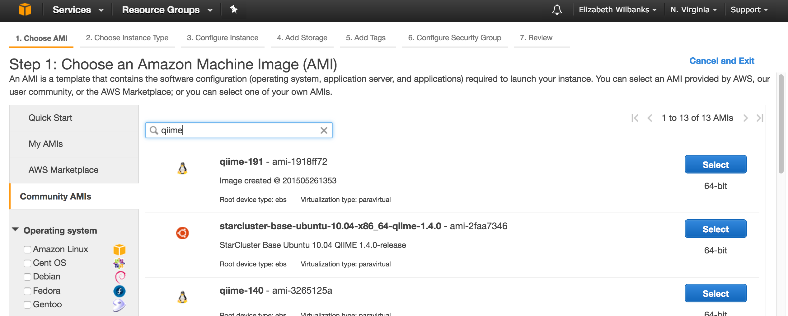
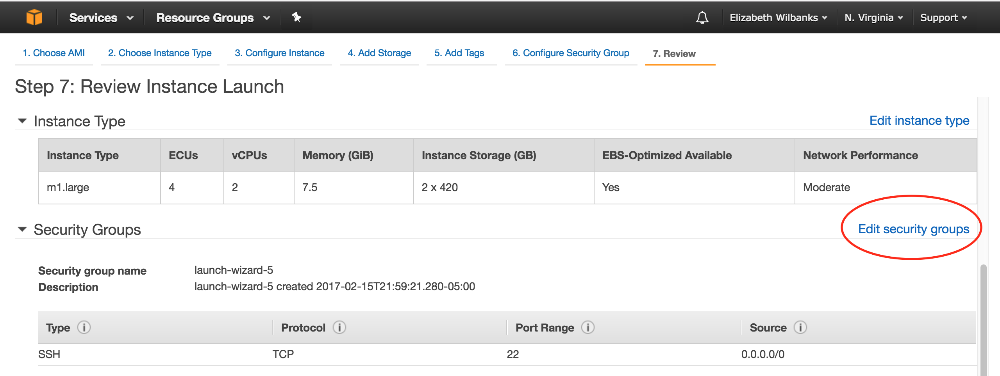
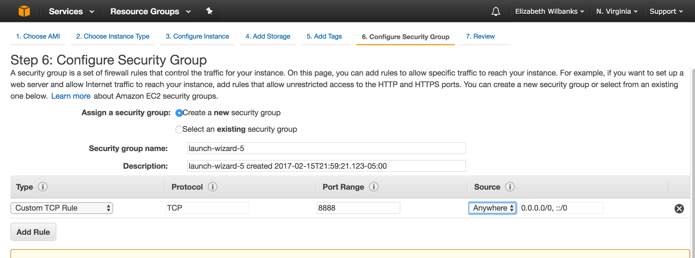

We're going to launch an EC2 instance, but unlike last time where we launched a "generic" Ubuntu server,
this time we're going to launch a machine created by the QIIME team.  The benefit of doing things this way
is that your instance will have (almost) all the software we need for today pre-installed!

We'll do this by using what's called a Community Amazon Machine Image or "Community AMI".  
Click here to learn more about [what *exactly* AMIs are](http://docs.aws.amazon.com/AWSEC2/latest/UserGuide/AMIs.html)

You should be able to follow below but if you're lost 
or need to set the key-pair for the first time, you can review [EC2 launch instructions here](http://angus.readthedocs.io/en/2016/amazon/index.html)

### Navigate to QIIME's community AMI
- Navigate to the [EC2 management console](https://console.aws.amazon.com/ec2/v2/home?region=us-east-1#LaunchInstanceWizard:)
- Be sure you are in the US East zone (North Virginia)
- Click on launch an instance
- At the left click on the sidebar that says "Community AMI"
- Under Community AMIs search for "qiime" to pull up machines that match that.  
- We want the first one listed below (qiime-191 - ami-1918ff72)
- Click Select
- You can also always find the most recent QIIME AMIs listed [here](http://qiime.org/home_static/dataFiles.html)



- Launch this AMI
- Select m1.large as the instance type for today 
- Click through to review & launch  (but don't finalize launch yet)

### Set a new security rule for your instance 
To log into your QIIME instance, you’ll need to have ssh access (i.e., port 22), which is enabled by default.
Later in the tutorial today, you'll want to use IPython Notebook on your instance, so you need to add another security rule. You can do this by clicking the link circled in red below:


- Then click `Add rule`
- For the new secturity rule fill out the fields as shown below
  - The Type should be Custom TCP Rule
  - the Protocol should be TCP
  - the Port Range should be 8888
  - the Source should be Anywhere.


### Now log into your QIIME EC2 instance
- On the EC2 console, look up the public DNS for your instance.
- Open a terminal window (of Mobaxterm for Windows users) and `ssh` into your instance

``` 
ssh -i /Users/ewilbanks/Desktop/amazon.pem ubuntu@ec2-204-236-222-237.compute-1.amazonaws.com 
```
